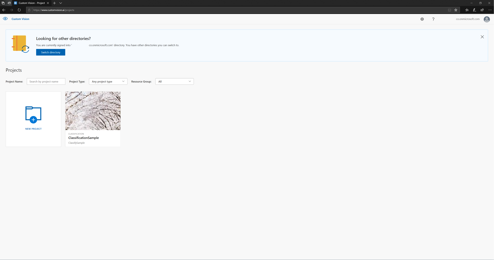
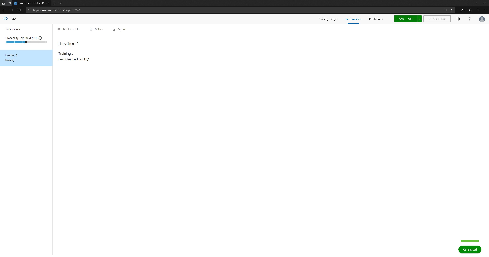
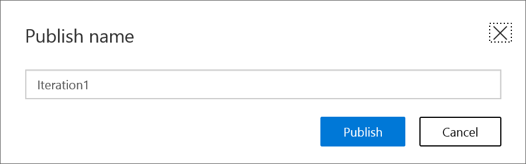

name: YA
layout: true
class: center, middle, inverse
---

# 機械学習で顔識別

---

layout:false

---

## テーマ

### あえて**オンプレ**で顔写真を判別する

---

## データセット

5人の人物の顔写真を用意

* 人物①：462枚
* 人物②：433枚
* 人物③：502枚
* 人物④：385枚
* 人物⑤：496枚
---
## 準備と実装

1. Pythonやライブラリのセットアップ
2. 画像ファイルから、データセットを作る<br>　
3. データセットを、<br>訓練データ/テストデータ/検証データに分ける<br>　
4. 学習モデルを生成する<br>　
5. 予測お試し用の静的サイトに学習モデルを導入する
---
## 1. Pythonやライブラリのセットアップ

```
Python==3.6.7
absl-py==0.7.1 astor==0.7.1 cycler==0.10.0 gast==0.2.2 grpcio==1.20.0
 h5py==2.9.0 Keras==2.2.4 Keras-Applications==1.0.7 Keras-Preprocessing==1.0.9
  kiwisolver==1.0.1 Markdown==3.1 matplotlib==3.0.3 mock==2.0.0 numpy==1.16.2
   opencv-contrib-python==4.1.0.25 opencv-python==4.1.0.25 pbr==5.1.3
    Pillow==6.0.0 protobuf==3.7.1 pyparsing==2.4.0 python-dateutil==2.8.0
     PyYAML==5.1 scipy==1.2.1 six==1.12.0 tensorboard==1.13.1 tensorflow==1.13.1
      tensorflow-estimator==1.13.0 termcolor==1.1.0 Werkzeug==0.15.2
```

⇒バージョンが`.1`違うだけでエラーになることも…
---
## 2. 画像ファイルから、データセットを作る

### (1) 画像ファイルを集める

`iCrawler`が便利


---
### (2) 画像ファイルから顔の部分だけを切り抜く

はじめは手作業で切り抜いていたが、OpenCVを利用して自動抽出するプログラムを書いた

⇒1週間くらい
---
### (3) 画像ファイルを加工して、データセットをかさ増し

* ランダムに色合いを変えさせる
* ランダムに垂直移動させる
* ランダムに水平方向に反転させる
* ランダムに回転させる
* ランダムにひし形に変形させる
* ランダムに垂直方向に反転させる
* ランダムに水平移動させる
* ランダムにズームさせる
---
## 3. データセットを、訓練データ/テストデータ/検証データに分ける

今回は `3:1:1` の割合でランダムに分けた
---
## 4. 学習モデルを生成する

ImageNetで学習済の畳み込みネットワークモデルである**VGG16**をベースに、全結合層だけ学習させ直した

⇒1周（エポック）6時間　×　10周　＝　60時間
---
## 5. お試し用静的サイトに学習モデルを導入する

OpenCV.jsとTensorFlow.jsを利用して、顔領域抽出から顔判別までをクライアントサイドで済ませるアプリを実装
---


※画像はイメージです

画像ファイルを収集してからここまで約2週間　⇒思い立ったらすぐ予測、という訳にはいかない
---
## テーマ

### あえて**オンプレ**で顔写真を判別する

## ⇒クラウドサービスのありがたみを感じる

---
layout: true
class: center, middle, inverse
---
# Azure Custom Vision
---
layout:false
## Custom Vision

https://www.customvision.ai

---
サインインして、規約に同意した直後


---
プロジェクトを作る


---
画像をアップロードする画面


---
タグを定義しておく<br>
　タグ⇒誰かを示すキーワード（人名でも数字でも）


---
ローカルにある画像ファイルを選択して、あらかじめ定義しておいたタグを指定する


---
アップロードに成功したことをチェック


---
たまに失敗することもある


---
画像ファイルを全部アップロードしたら、Train（訓練）する


---
Training...


---
あっという間に終わる


---
## 評価指標

* Precision　... tp/(tp+fp)<br>　見つけたもののうち、それが正解である割合<br>　
* Recall　... tp/(tp+fn)<br>　正解のうち、正しく見つけることができた割合<br>　
* AP　... 正解を見つけた順序を考慮した評価指標
---
Publishすると、外部からAPIとして呼び出せる


---
**Quick Test**にアクセスすると、ブラウザで簡単に予測結果をチェックできる


---
ポータルの中で、ファイルを選択してアップロード


---
右側に、可能性が高い順にタグがリストアップされる


---
右側に、可能性が高い順にタグがリストアップされる


---
次に、Prediction URLをチェック


---
プログラムからでもRESTクライアントからでも、このURLを叩けば予測結果を返してくれる


---
**RESTED**で試してみた


---
結果はJSON形式で返ってくる


---
クラウドサービスでは、画像ファイルをアップロードしてからここまで約1時間!!
---
## テーマ

### あえて**オンプレ**で顔写真を判別する

## ⇒クラウドサービスのありがたみを感じる
---
## テーマ

### あえて**オンプレ**で顔写真を判別する

## ⇒クラウドサービスのありがたみを感じた
---
## まとめ

* クラウドサービスを使うと、迅速に、気軽に、ラクに機械学習できる
* AWS RekognitionはマネージドコンソールからGUIで操作できず、とっつきにくかった<br>　⇒何か用意したい
* Azure Custom VisionだとGUIで学習から予測、評価までGUIで完結する
* 業務でも活用したい…<br>　（予兆検知など、研究開発でいくつかの案を検討中）
---
